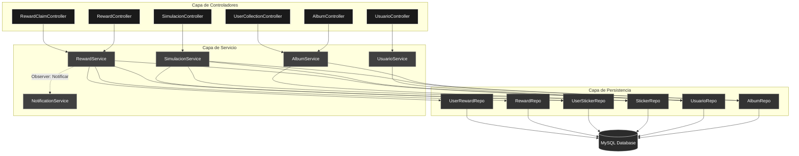

# Descripción del Proyecto
Es un sistema diseñado para administrar el ciclo de vida completo de un álbum de figuritas digital. No solo gestiona datos, sino que implementa lógica de negocio compleja como simulaciones de probabilidad, control de estados de premios y analítica de colecciones en tiempo real.

---

## Arquitectura del Sistema
El núcleo del sistema se basa en una separación clara de responsabilidades, orquestando el flujo de datos desde los controladores REST hasta la capa de persistencia JPA.

### Diagrama de Dependencias y Flujo de Datos


### Patrones de Diseño Implementados
| Patrón | Componente | Propósito |
| :--- | :--- | :--- |
| **Observer** | `NotificationService` | Desacopla la lógica de recompensas del sistema de notificaciones, permitiendo enviar emails sin afectar la transacción principal. |
| **State** | `RewardStateEnum` | Gestiona el ciclo de vida de los premios (`NO_RECLAMADO` → `RECLAMADO`), asegurando que un usuario no pueda reclamar el mismo premio dos veces. |
| **MVC** | Global | Separación estándar de la interfaz (API), lógica de negocio y acceso a datos. |
| **DTO** | `UserRewardDTO`, `CollectionProgressDTO` | Transferencia eficiente de datos entre capas, protegiendo la estructura interna de la base de datos. |
---

## Estructura del Proyecto
El código fuente está organizado modularmente por dominios funcionales:

```plaintext
src/main/java/figuritas/album/
├── album/          # Gestión central de Álbumes
├── usuario/        # Gestión de Usuarios y Autenticación
├── reward/         # Lógica de Premios y Estados (State Pattern)
├── userSticker/    # Relación Usuario-Figurita (Inventario)
├── sticker/        # Definición de Assets y Rareza
├── simulacion/     # Motor de Probabilidad 
├── api/            # Interfaces y documentación
└── response/       # Wrappers estandarizados (ResponseApi)
```

---

## Funcionalidades Principales

### 1. Simulación de Compra
* **Endpoint:** `POST /api/v1/simulacion/comprar`
* **Lógica:** Implementa un algoritmo probabilístico que genera paquetes de 5 figuritas aleatorias. El servicio gestiona automáticamente la asignación a la colección del usuario, detectando si la figurita es nueva o repetida (para intercambio).

### 2. Analítica de Colección
* **Progreso en Tiempo Real:** Cálculo dinámico del porcentaje de completitud del álbum.
* **Gestión de Faltantes:** Identificación automática de los ítems necesarios para completar una sección.
* **Estadísticas de Rareza:** Reportes sobre la distribución de activos (Comunes, Raras, Épicas) en el inventario del usuario.

### 3. Sistema de Recompensas
* **Integridad Transaccional:** Uso de bloqueo pesimista y transacciones ACID para prevenir condiciones de carrera durante el reclamo de premios.
* **Notificaciones:** Envío asíncrono de correos electrónicos de confirmación tras obtener una recompensa exitosamente.

---

## Stack Tecnológico
* **Lenguaje:** Java 21 
* **Framework:** Spring Boot 3.5.6
* **Base de Datos:** MySQL 8.0 / PostgreSQL
* **Persistencia:** Spring Data JPA (Hibernate)
* **Documentación:** Swagger / OpenAPI 3.0
* **Utilidades:** Lombok, Jakarta Validation, Java Mail
* **Testing:** H2 Database (In-Memory), JUnit 5

---

## 📦 Despliegue y Ejecución

### Prerrequisitos
* Docker y Docker Compose
* Java 21 SDK (opcional para ejecución local)

### Iniciar con Docker 
El proyecto incluye un archivo `compose.yaml` para orquestar la API y la base de datos.

```bash
docker-compose up -d
```
El servicio estará disponible en el puerto **8080**.

### Documentación API Interactiva
Una vez iniciada la aplicación, se puede acceder a la documentación completa de los endpoints en:
* **Swagger UI:** [http://localhost:8080/swagger-ui.html](http://localhost:8080/swagger-ui.html)
